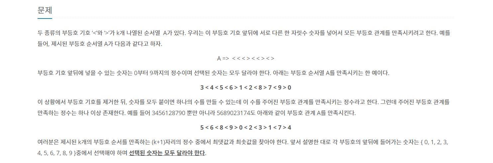

# 부등호
---
[백준 2529번 부등호 문제 링크](https://www.acmicpc.net/problem/2529)

<span style="Color:blue">[ Greedy Algorithm ]</span>



```python
def select(i, j, k):
    if k == '<':
        return i<j
    if k == '>':
        return i>j
    return True

def algorithm(count, s):
    global max_num, min_num

    if count == K + 1:
        if not len(min_num):
            min_num = s
        else:
            max_num = s
        return
    for i in range(10):
        if not num_check[i]:
            if count == 0 or select(s[-1], str(i), simbol[count-1]):
                num_check[i] = True
                algorithm(count+1, s+str(i))
                num_check[i] = False


if __name__ == "__main__":
    K = int(input())
    simbol = input().split()
    num_check = [False] * 10
    max_num, min_num = "", ""

    algorithm(0, "")
    print(max_num)
    print(min_num)
```
