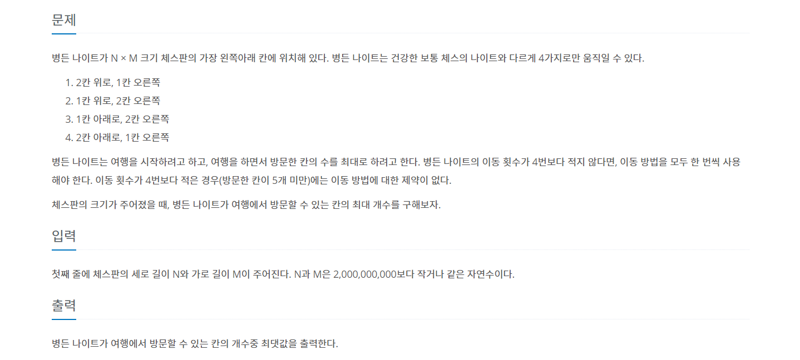

# 병든 나이트
---

<span style="Color:blue">[ Greedy Algotithm ]</span>

[백준 1783번 병든나이트 문제 링크](https://www.acmicpc.net/problem/1783)



```python
def algorithm():
    if N > 2:
        if M <= 6:
            print(min(4, M))
        else:
            print(M - 2)
    elif N == 2:
        print(min(4, (M+1) // 2))
    else:
        print("1")

if __name__ == "__main__":
    N, M = map(int, input().split(" "))
    algorithm()
```
