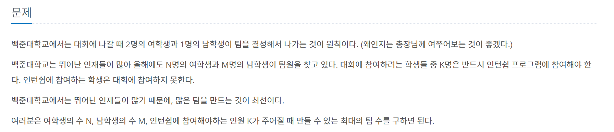

# 대회 or 인턴

---

<span style="Color:blue"> [ Greedy Algorithm ]</span>



```python
def make_team(N, M, K):
    max_T = min(N//2, M)
    remain = (N - max_T * 2) + (M - max_T)

    if remain < K:
        K = K - remain
        max_T = (max_T * 3 - K) // 3
    print(max_T)

if __name__ == "__main__":
    N, M, K = map(int, input().split(" "))
    make_team(N, M, K)
```
