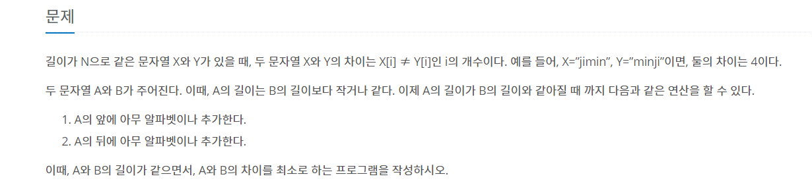

# 문자열

---

[백준 1120번 문자열](https://www.acmicpc.net/problem/1120)

[ Greedy Algorithm ]



```python
def algorithm(A, B):
    Min = 50

    for i in range(len(B) - len(A) + 1):
        count = 0
        for j in range(len(A)):
            if A[j] != B[i+j]:
                count += 1
        if count < Min:
            Min = count
    print(Min)

if __name__ == "__main__":
    A, B = input().split(" ")
    algorithm(A, B)
```
