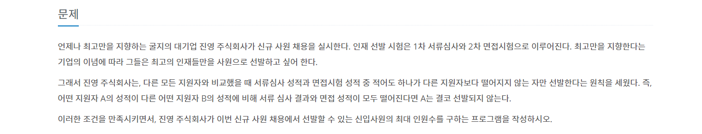

# 신입 사원
---

[백준 1946번 신입사원 문제 링크](https://www.acmicpc.net/problem/1946)

[ Greedy Algorithm ]



```python
import sys
input = sys.stdin.readline     # 오류 발생 시 주석처리

if __name__ == "__main__":
    tc = int(input())
    for i in range(tc):
        n = int(input())
        s = [0 for i in range(n + 1)]
        for j in range(n):
            a, b = map(int, input().split())
            s[a] = b
        min_n = s[1]
        cnt = 0
        for k in range(2, n + 1):
            if s[k] > min_n:
                cnt += 1
            else:
                min_n = s[k]
        print(n - cnt)
```
