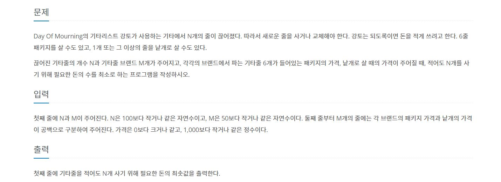

# 기타줄

---
[백준 1049번 기타줄 링크](https://www.acmicpc.net/problem/1049)

<span style="Color:blue"> [ Greedy Algorthm ]</span>



```python
def algorithm(N, M):
    price = 0
    min_pac = 1001
    min_sin = 1001
    for _ in range(M):
        package, single = map(int, input().split(" "))
        min_pac = min(min_pac, package)
        min_sin = min(min_sin, single)
    if min_pac < min_sin * 6:
        if min_pac < (N % 6) * min_sin:
            print((N // 6) * min_pac + min_pac)
        else:
            print((N // 6) * min_pac + (N % 6) * min_sin)
    elif min_pac >= min_sin * 6:
        print(N * min_sin)

if __name__ == "__main__":
    N, M = map(int, input().split(" "))
    algorithm(N, M)
```
