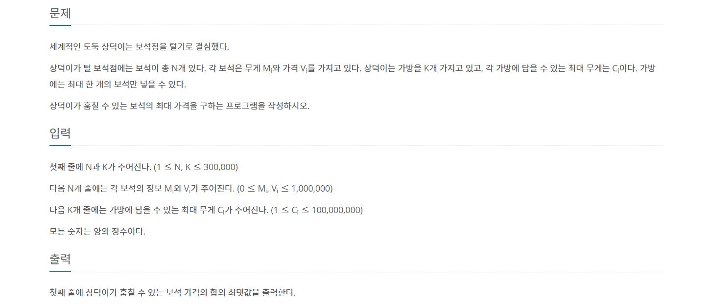

# 보석 도둑
---
[백준 1202번 보석도둑 문제 링크](https://www.acmicpc.net/problem/1202)

<span style="Color:blue">[ Greedy Algorithm ]</span>



```python
def algorithm():
    check = [ False for _ in range(K) ]
    result_price = 0
    jew.sort(key=lambda x:x[1], reverse=True)
    max_w.sort()

    for i in range(N):
        for j in range(K):
            if jew[i][0] < max_w[j] and check[j] == False:
                result_price += jew[i][1]
                check[j] = True
    print(result_price)

if __name__ == "__main__":
    N, K = map(int, input().split(" "))
    jew = [list(map(int, input().split(" "))) for _ in range(N)]
    max_w = [int(input()) for _ in range(K)]
    algorithm()
```
