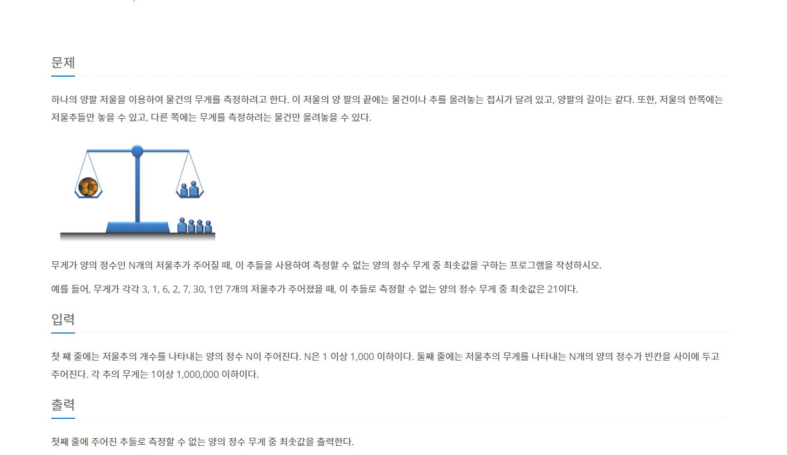

# 저울

---

<span style="Color:blue">[ Greedy Algorithm ]</span>

[백준 2437번 저울 문제 링크](https://www.acmicpc.net/problem/2437)



```python
def algorithm():
    for min_num in range(1, sum(weight)+1):
        copy_num = min_num
        for sub in weight:
            if sub <= copy_num:
                copy_num -= sub
                if copy_num == 0:
                    break
        if copy_num != 0:
            print(min_num)
            return


if __name__ == "__main__":
    N = int(input())
    weight = list(map(int, input().split(" ")))
    weight.sort(reverse=True)
    algorithm()
```
